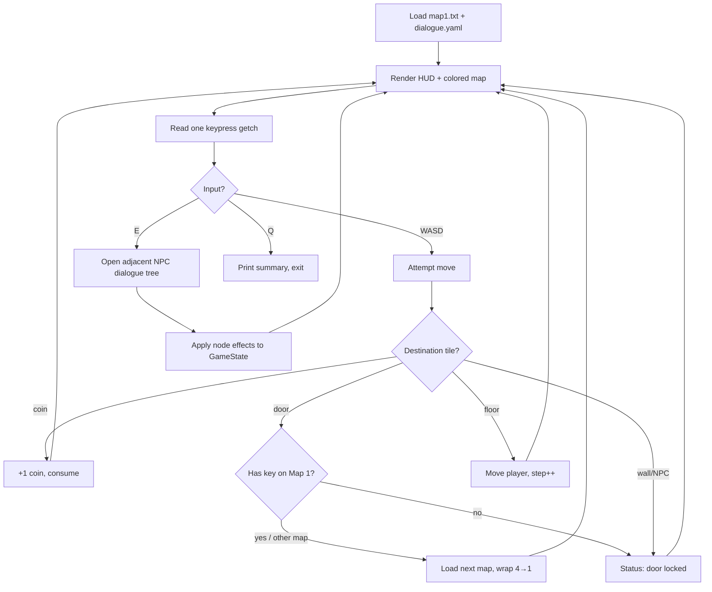

# cpp-game

[](#)
[](#)
[](#)
[-4DC71F)](#)

**A single-file C++17 terminal maze game — explore themed maps, talk your way past NPCs, and solve a riddle to unlock the doors between them.**

cpp-game is a small, dependency-light grid explorer that runs in any ANSI-capable terminal. You play `@`, moving tile-by-tile through hand-drawn ASCII maps, collecting coins, and chatting with characters whose dialogue is authored as branching YAML trees. The conversation you choose has real consequences: NPCs can hand you coins, set status messages, and — if you answer their riddle correctly — hand over the key that unlocks the door to the next area. Everything renders in color through raw ANSI escapes, with the terminal switched into raw mode via an RAII guard so your shell is always restored on exit.

## ✨ Features

- **Four connected maps** — Football Ground, Pool Area, Classroom 101, and School Yard, each with its own layout, coins, and NPC placement. Doors link them in sequence and wrap around after the last.
- **Branching YAML dialogue** — every NPC is a tree of named nodes with `text`, numbered `choices`, and optional `effects`. Write the script, drop the file in, no recompile.
- **Choice-driven state** — dialogue effects mutate coins, health, the key flag, and the status line. Answer the riddle right and you walk away with the brass key.
- **Locked-door gating** — the door on Map 1 stays shut until you carry the key, nudging you toward exploration and conversation before you can travel.
- **Color TUI with HUD** — ANSI-colored walls, coins, NPCs, and doors, plus a live heads-up display showing current map, coin count, key status, and a 10-segment health bar.
- **Cross-platform** — builds and runs on Linux, macOS, and Windows. POSIX `termios` raw mode on Unix, `_getch`/`cls` on Windows.
- **RAII terminal handling** — a `TerminalMode` guard captures your original terminal settings on construction and restores them on destruction, so a crash or `Ctrl-C` never leaves your shell in a broken state.
- **Zero framework** — one ~400-line `main.cpp`, the C++ standard library, and `yaml-cpp`. No engine, no assets beyond text files.

## 📦 Installation

**Prerequisites**

- A C++17 compiler (`clang++` or `g++`)
- `make`
- `pkg-config` (recommended, so the Makefile can locate `yaml-cpp` automatically)
- `yaml-cpp`

**Install yaml-cpp**

```bash
# macOS (Homebrew)
brew install yaml-cpp pkg-config

# Debian / Ubuntu
sudo apt install libyaml-cpp-dev pkg-config

# Arch Linux
sudo pacman -S yaml-cpp pkgconf
```

**Build**

```bash
git clone https://github.com/bhoot1234567890/cpp-game.git
cd cpp-game
make
```

The Makefile probes `pkg-config` for `yaml-cpp` first, then falls back to `brew --prefix yaml-cpp`. To override either, set `YAMLCPP_CFLAGS` and `YAMLCPP_LIBS` on the command line.

## 🚀 Usage

Run the game from the repository root — it loads `dialogue.yaml` and the `map*.txt` files by relative path, so launching it from another directory will fail.

```bash
./game
```

**Controls**

| Key | Action |
|-----|--------|
| `W` `A` `S` `D` | Move up / left / down / right |
| `E` | Talk to an adjacent NPC |
| `Q` | Quit |

Walk into a coin (`o`) to pick it up. Walk into a door (`◊`) to travel to the next map — though the Map 1 door is locked until you obtain the key. Approach an NPC and the prompt `💬 Press E to talk` appears.

**Expected output**

The screen redraws each turn with a bordered HUD, the colored map, and contextual prompts:

```text
═══════════════════════════════════════
 Map 1/4  │  Coins: 0  │  Key: ✗  │  HP: [████░░░░░░]
═══════════════════════════════════════
► You bump into the edge of the world.

 ##############################
 #      FOOTBALL  GROUND      #
 #   ●                    ●   #
 ...
 # P |        @@          | ● #
 ...
 ##############################

 💬 Press E to talk
 🚪 Walk into door to travel

[W/A/S/D] Move  [E] Interact  [Q] Quit:
```

Talking to NPC `C` and answering *"A piano."* to the riddle grants the key, after which the Map 1 door opens and you can roam all four maps. On quit, a short summary reports your steps and coins collected.

## ⚙️ Customizing content

Game content lives in plain text files you can edit without touching C++.

**`dialogue.yaml`** defines every NPC as a top-level key (the character drawn on the map). Each NPC maps node names to nodes with:

- `text` — the line shown for that node
- `choices` — numbered options, each with `text` (the prompt) and `next` (the node to jump to, or `end` to exit the conversation)
- `effects` *(optional)* — a map of state changes applied when the node is reached

```yaml
C:
  correct:
    text: "Correct. The maze approves your taste."
    effects:
      key: true
      coins: 5
      health: 10
      message: "You got a key."
    choices:
      1:
        text: "I accept this suspiciously specific key."
        next: end
  end:
    text: "Farewell."
```

Supported effects:

| Effect | Type | Description |
|--------|------|-------------|
| `coins` | `int` | Added to the coin counter |
| `health` | `int` | Added to HP, clamped to `[0, 100]` |
| `key` | `bool` | Sets whether the player holds the key |
| `message` | `string` | Sets the status line shown under the HUD |

Any printable letter defined as a top-level key in `dialogue.yaml` automatically becomes an interactable NPC when it appears on a map.

**Map files** (`map1.txt`–`map4.txt`) are plain text grids using these tiles:

| Character | Meaning |
|-----------|---------|
| `#` | Wall (impassable) |
| `.` / ` ` | Floor (walkable) |
| `P` | Player spawn (exactly one per map) |
| `o` | Coin (picked up on entry) |
| `D` | Door (travels to the next map; locked on Map 1 without the key) |
| `A`–`Z` *(other)* | NPC, if the letter is a key in `dialogue.yaml` |

## 🧱 How it works

The entire game is a single translation unit. `main()` loads the first map and `dialogue.yaml`, then runs a render → input → update loop:



Key implementation notes:

- **`TerminalMode`** — RAII wrapper around `tcgetattr`/`tcsetattr`. On POSIX it snapshots your terminal's `termios` state in its constructor and restores it in its destructor, so raw mode never leaks even if the program exits unexpectedly. The Windows path uses `_getch()` instead.
- **`GameState`** — a single struct (`currentMap`, `coins`, `health`, `hasKey`, `steps`, `status`, `underPlayer`) threaded through the loop and mutated by `applyDialogueEffects`.
- **`underPlayer`** — the tile beneath the player is saved on each move and restored when they leave, so coins and decorations aren't erased by the player's trail.
- **NPC detection** — instead of a hardcoded character list, the engine treats any printable letter that exists as a top-level key in `dialogue.yaml` as an NPC. Add a dialogue entry and the letter becomes a character, no code change required.

## 🤝 Contributing

This is a small personal project. Feel free to open an issue or pull request at <https://github.com/bhoot1234567890/cpp-game> — new maps, richer dialogue trees, and additional effect types are all easy wins since content is data-driven.

## 📄 License

No license file is present in this repository, so the code is "all rights reserved" by default. If you intend to use or adapt it, please open an issue to confirm terms with the author first.
